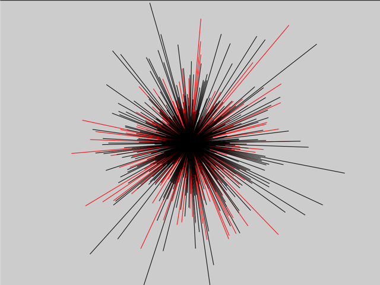

## PRNG 
- That delivers 2D random variables with a normal distribution
- Visualizes the first n drawn vectors

- Implemented with two variations, red one is a p5js gaussian random
- black is custom random generation function which is implemented by Box muller transform technique